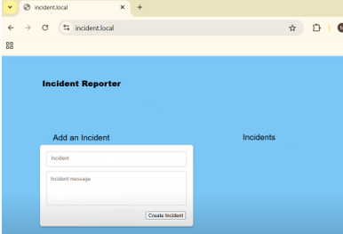
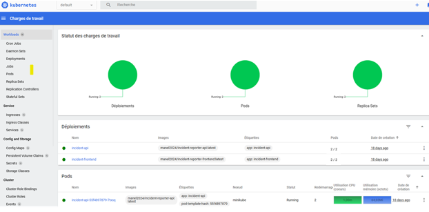
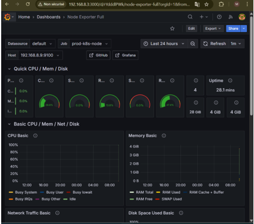

# 🛡️ Incident Reporter – Projet DevSecOps

Application MERN sécurisée, déployée automatiquement via Jenkins CI/CD, analysée par SonarQube et Trivy, et supervisée via Grafana + Prometheus.

---

## ⚙️ Stack Technique

- **Frontend** : React + Vite  
- **Backend** : Node.js + Express  
- **Base de données** : MongoDB  
- **CI/CD** : Jenkins  
- **Déploiement** : Docker + Kubernetes  
- **Sécurité** : SonarQube, Trivy, JWT  
- **Monitoring** : Grafana + Prometheus

---

## 🚀 Lancer en local

```bash
git clone https://github.com/ton-utilisateur/incident-reporter.git
cd incident-reporter
docker-compose up --build
```

- Frontend : http://localhost  
- Backend : http://localhost:3000

---

## 📦 Arborescence

```
incident-reporter/
├── backend/
├── frontend/
├── k8s/
├── Jenkinsfile
├── docker-compose.yml
├── captures/
└── README.md
```

---

## 🔁 Pipeline CI/CD Jenkins

Voici le pipeline automatisé utilisé dans ce projet :

---

### 🧹 1. Nettoyage de l’environnement

Suppression des anciens conteneurs et volumes Docker pour garantir un environnement propre avant chaque build.

```groovy
stage('Nettoyage environnement') {
  ...
}
```


---

### 🧪 2. Tests unitaires backend

Installation des dépendances et exécution des tests dans `backend/`.

```groovy
stage('Tests unitaires backend') {
  ...
}
```

📸 *Interface de l’application après déploiement (frontend React connecté au backend) :*



---

### 🧠 3. Analyse de code avec SonarQube

Analyse de qualité et de sécurité du code backend (bugs, vulnérabilités, duplications, code smells…).

```groovy
stage('Analyse SonarQube') {
  ...
}
```


---

### 🐳 4. Build des images Docker

Construction des images du frontend et du backend à l’aide de Docker Compose.

```groovy
stage('Build des conteneurs') {
  ...
}
```


---

### 🔐 5. Scan de sécurité avec Trivy

Scan de sécurité des images Docker pour détecter les vulnérabilités (CVEs) critiques.

```groovy
stage('Scan de sécurité avec Trivy') {
  ...
}
```


---

### 📤 6. Push des images vers Docker Hub

Les images sont taggées et envoyées sur Docker Hub pour être récupérées en production.

```groovy
stage("Push des images vers Docker Hub") {
  ...
}
```


---

### ☸️ 7. Déploiement sur Kubernetes

Déploiement des fichiers `YAML` sur un cluster distant via SSH + `kubectl`.

```groovy
stage('Déploiement sur Kubernetes') {
  ...
}
```

📸 *Dashboard Kubernetes après déploiement :*



---

### 📊 8. Supervision & Monitoring

Supervision des ressources via Prometheus (metrics) et affichage via Grafana (dashboards).

📸 *Dashboard Grafana personnalisé pour les conteneurs et le système :*



---

## ✅ Résultat final

Une application :
- Déployée automatiquement
- Sécurisée et analysée
- Supervisée
- Structurée DevOps/DevSecOps

---

##  Réalisé par

**Manel — DevSOps Engineer**  
  

---


